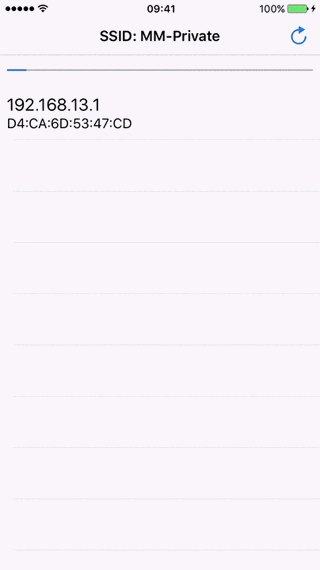

MMLanScan
======

MMLanScan is an open source project for iOS that helps you scan your network and shows the available devices and their MAC Address, hostname and Brand name.


### Important for iOS 11
iOS 11 is breaking the MAC address retrieval from ARP table so MAC Addresses and Brands won't work on MMLanScan with iOS 11.
We still using MacFinder since it's helpful in order to discover online devices that won't reply to pings.

### Note
You can find a NativeScript wrapper of MMLanScan [here!](https://www.npmjs.com/package/nativescript-lan-scan)

### Screenshot


### Features
+ Scans and finds available hosts in your network
+ Shows IP Address
+ Shows MAC Address (iOS 10 and below)
+ Shows Brand of device based on MAC Address (iOS 10 and below)
+ Shows hostname (if available)
+ Scan any subnet (not only /24)
+ Gives you the ability to update the OUI (MAC-Brand mappings) plist file. Check in MainPresenter.m for more details

### Manual Installation
- Drag n Drop the MMLanScan folder in your project.

### CocoaPods Installation
To install using CocoaPods, simply add the following line to your Podfile:

```ruby
pod 'MMLanScan'
```
### How to use it (Objective C)

Import MMLANScanner in your controller
```
#import "MMLANScanner.h"
```

Add the MMLANScannerDelegate (Protocol) to your controller
```
@interface YourViewController () <MMLANScannerDelegate>
```

Declare a property
```
@property(nonatomic,strong)MMLANScanner *lanScanner;
```

Initialize with delegate
```
self.lanScanner = [[MMLANScanner alloc] initWithDelegate:self];
```

Start the scan
```
[self.lanScanner start];
```

Implement the delegates methods to receive events
```
- (void)lanScanDidFindNewDevice:(MMDevice*)device;
- (void)lanScanDidFinishScanningWithStatus:(MMLanScannerStatus)status;
- (void)lanScanProgressPinged:(NSInteger)pingedHosts from:(NSInteger)overallHosts;
- (void)lanScanDidFailedToScan;
```

### How to use it (Swift)
After Drag n Drop the MMLanScan folder in your Swift project Xcode will ask you to create a bridging header. Create the bridging header and copy paste the following between `#define` and `#endif`:
```
#import "MMLANScanner.h"
#import "LANProperties.h"
#import "PingOperation.h"
#import "MMLANScanner.h"
#import "MACOperation.h"
#import "MacFinder.h"
#import "MMDevice.h"
```
Add the MMLANSCannerDelegate (Protocol) to your controller
```
class MyVC: NSObject, MMLANScannerDelegate 
```

Declare the variable for the MMLanScanner
```
var lanScanner : MMLANScanner!
```

Initialise the MMLanScanner (after self is initialised)
```
self.lanScanner = MMLANScanner(delegate:self)
```

And finally start the scan:
```
self.lanScanner.start()
```

Or stop the scan
```
self.lanScanner.stop()
```

Implement the delegates methods to receive events
```
func lanScanDidFindNewDevice(_ device: MMDevice!)
func lanScanDidFinishScanning(with status: MMLanScannerStatus)
func lanScanProgressPinged(_ pingedHosts: Float, from overallHosts: Int)
func lanScanDidFailedToScan()
```

### Project Demo
You can find project demos available in Swift or Objective-C. Feel free to copy/use them for your product.
Note: Project demos are written using software design pattern [MVVM](https://www.objc.io/issues/13-architecture/mvvm/)

### How it works
MMLanScan works like the classic network scanner. It first ping every host in the network in order to built the ARP table and then is trying to get the MAC Address for each host. If a MAC Address is found then it's considered that the host exist in the network.

### Libraries used to built MMLanScan
- Apples [SimplePing](https://developer.apple.com/library/mac/samplecode/SimplePing/Introduction/Intro.html) 
- My [MacFinder](https://github.com/mavris/MacFinder)

### Technical Stuff
MMLanScan V2.0 is now using NSOperation and NSOperationQueueManager. Scanning time, and UI interactions are improved compared to V1.0. Also V1.0 was ignoring hosts that didn't replied to pings. V2.0 is not and the result is now accurate.

### TODO
If anyone would like to help:
- ~~Convert the [OUI]~~ (https://standards.ieee.org/develop/regauth/oui/oui.txt) ~~text in a dictionary so we can map MAC Address with vendor (Hint: The Regex to catch the first line with MAC Address and vendor: ```[A-F0-9]{2}-[A-F0-9]{2}-[A-F0-9]{2}\s*\(hex\)\s*[A-Za-z\.\, \-]+```)~~
- ~~Make it work in a background thread. Apple's SimplePing has issues when it comes to GCD (it's built on C libraries and it seems their callbacks won't work with GCD)~~
- ~~Get hostname from IP address method is not working~~
- Anything that you feel that will improve this library.

### More Details

Visit my [article](https://medium.com/rocknnull/ios-a-new-lan-network-scanner-library-has-been-born-f218f1a416a5#.sryxaq3b1) for MMLanScan for more details

### Authors
* Michael Mavris

### Credits
 + Thanks [@jpalten](https://github.com/jpalten) for several tweeks and features
 + Issue for MAC Addresses on iOS 10.2 has been resolved thanks to [@mochasoft] (https://github.com/mochasoft)
 + Wrapper for [NativeScript](https://www.npmjs.com/package/nativescript-lan-scan) developed by [@toddanglin](https://github.com/toddanglin)

### License
Copyright Miksoft 2017

Licensed under the MIT License
